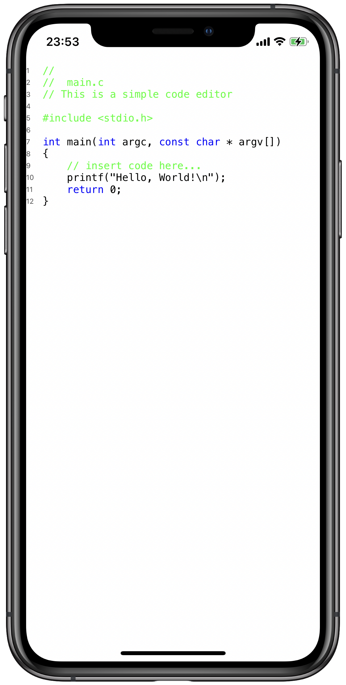

## TextKit Editor

This is a super simple code editor made with TextKit APIs with some dumb syntax highlighting logic.

I have created this project to learn how `NSTextContainer`, `NSTextStorage`, `NSLayoutManager` and `UITextView` work and render text.

The `UITextView` has then been wrapped in a `UIViewRepresentable` view and used in a SwiftUI application

